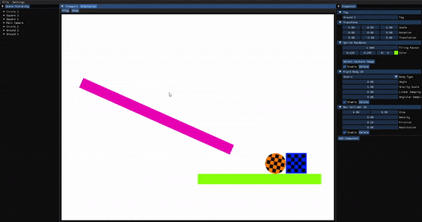

# Konto Beans
It is a simple game engine that I am working. I am learning more about programming
game engines and computer graphics.

# Screenshots



# Install

```console
$ git clone --recurse-submodules git@github.com:ckacquah/konto-beans.git
$ cd konto-beans
$ mkdir build
$ cd build
$ cmake ../
```

